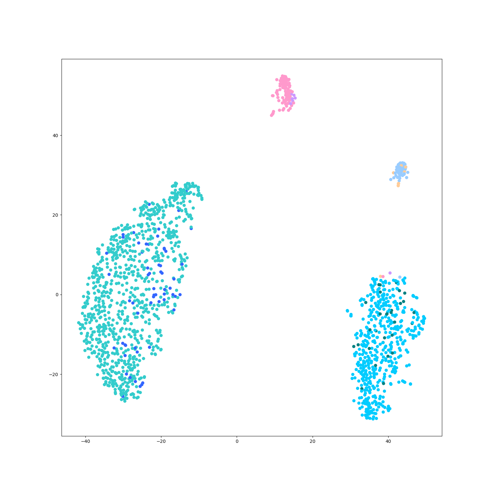
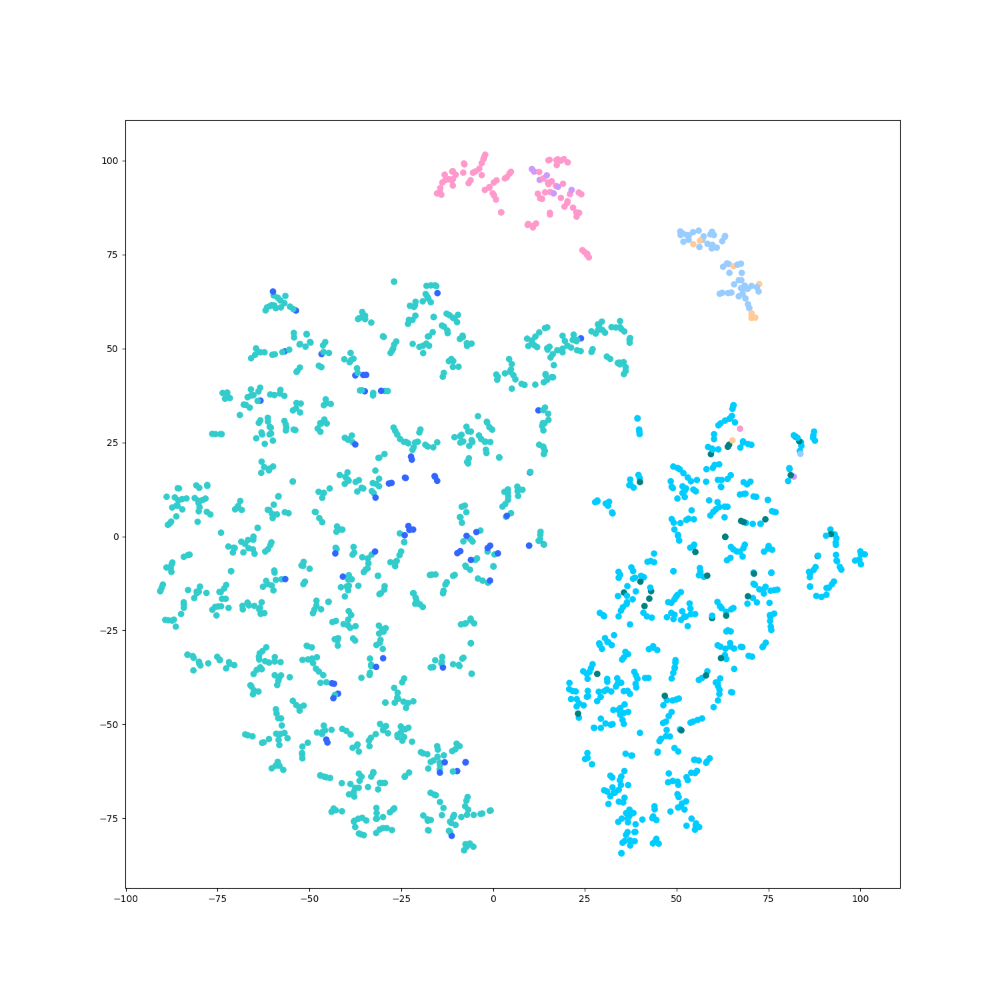

# StackingSingleCellClassify

My ideas and implements.

## Files and functions

### Utils.py

#### get_color(labels, colors)

Get color list for drawing based on labels.

----

### ReadData.py

#### read_from_mat(filePath)

Read data from `.mat` file.

#### read_from_csv(filePath)

Read data from `.csv` file.

----

### DimensionReduction.py

#### t_SNE(data, dim)

Get t-SNE result from data.

#### get_pca(data, dim)

Get PCA results from data.

----

### examples_***.py

Welcome to run the examples to know more!

### xin dataset (human islet) 1600 samples

perplexity = 50

perplexity = 5

