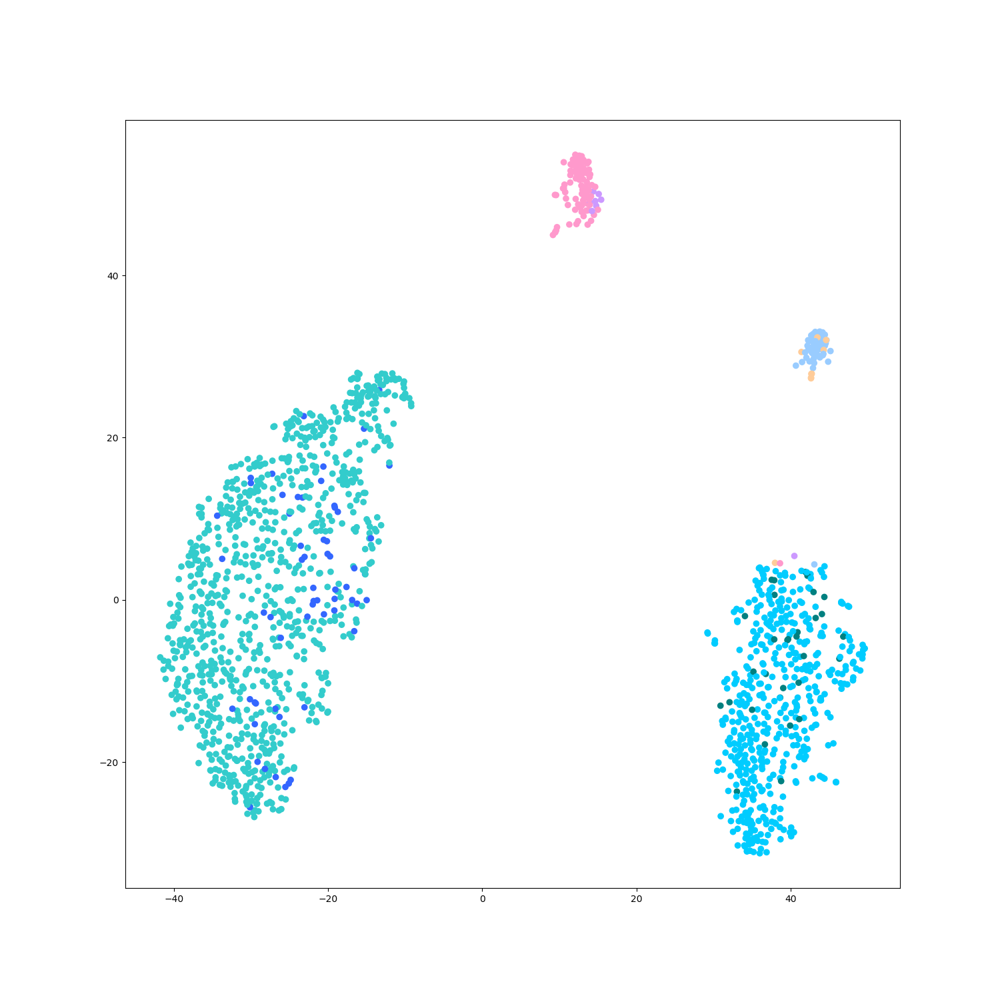
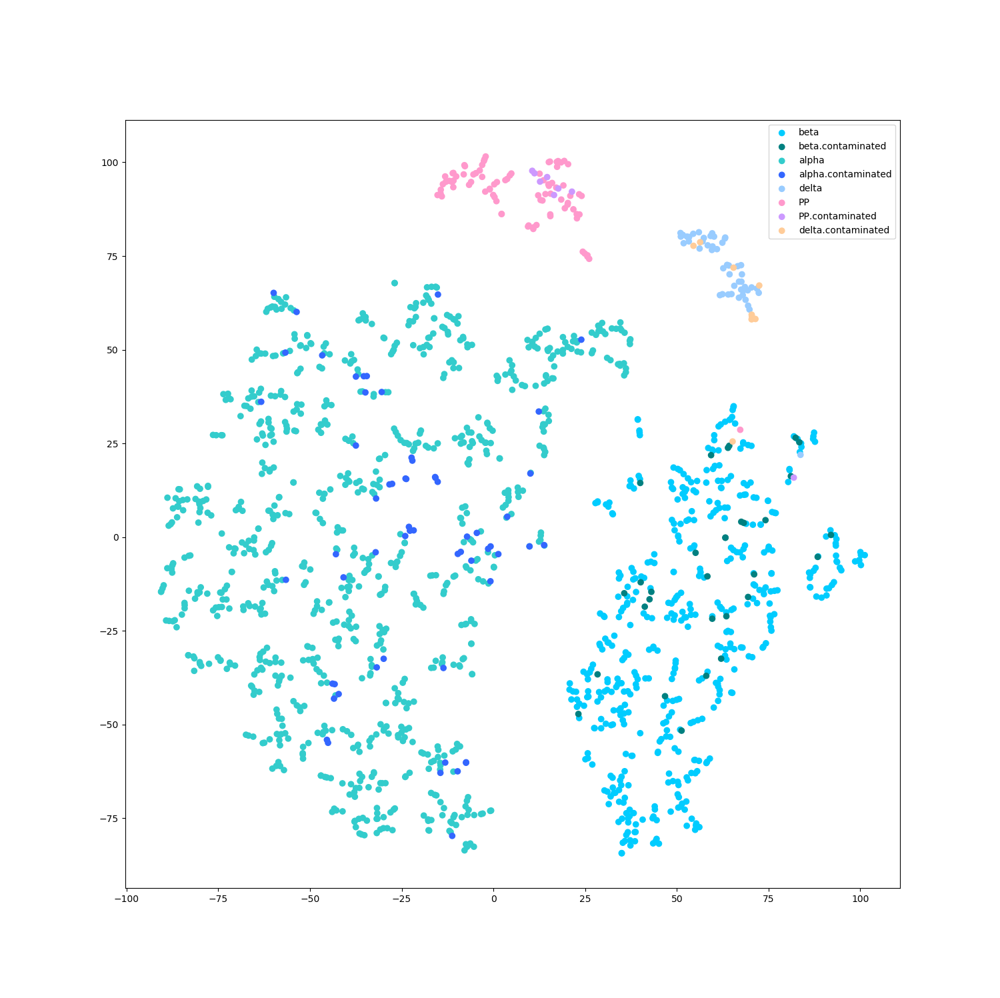

# StackingSingleCellClassify

My ideas and implements.

## Files and functions

### Utils.py

#### get_color(labels, colors)

Get color list for drawing based on labels.

----

### ReadData.py

#### read_from_mat(filePath)

Read data from `.mat` file.

#### read_from_csv(filePath)

Read data from `.csv` file.

----

### DimensionReduction.py

#### t_SNE(data, dim)

Get t-SNE result from data.

#### get_pca(data, dim)

Get PCA results from data.

----

### examples_***.py

Welcome to run the examples to know more!

### Xin dataset (human islet) 1600 samples using t-SNE

perplexity = 50

perplexity = 5

This dataset file is too large to upload, please download it from:

[data-download](https://www.ncbi.nlm.nih.gov/geo/download/?acc=GSE81608&format=file&file=GSE81608%5Fhuman%5Fislets%5Frpkm%2Etxt%2Egz)

[label-download](https://s3.amazonaws.com/scrnaseq-public-datasets/manual-data/xin/human_islet_cell_identity.txt)

Xin, Y. et al. RNA Sequencing of Single Human Islet Cells Reveals Type 2 Diabetes Genes. Cell Metab. 24, 608–615 (2016)
