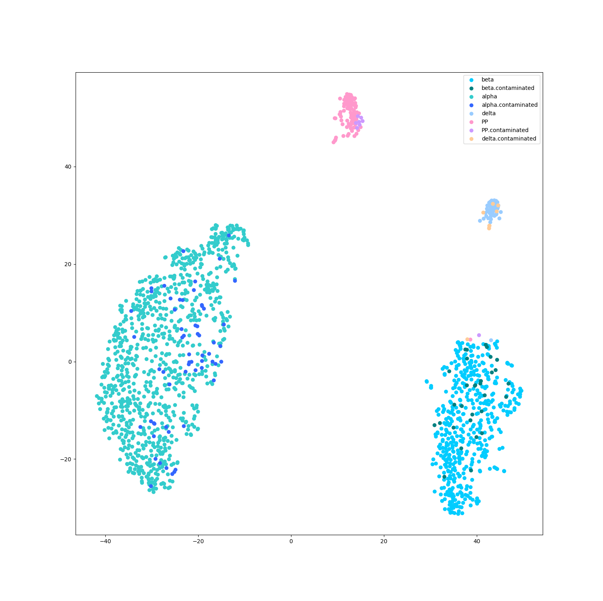
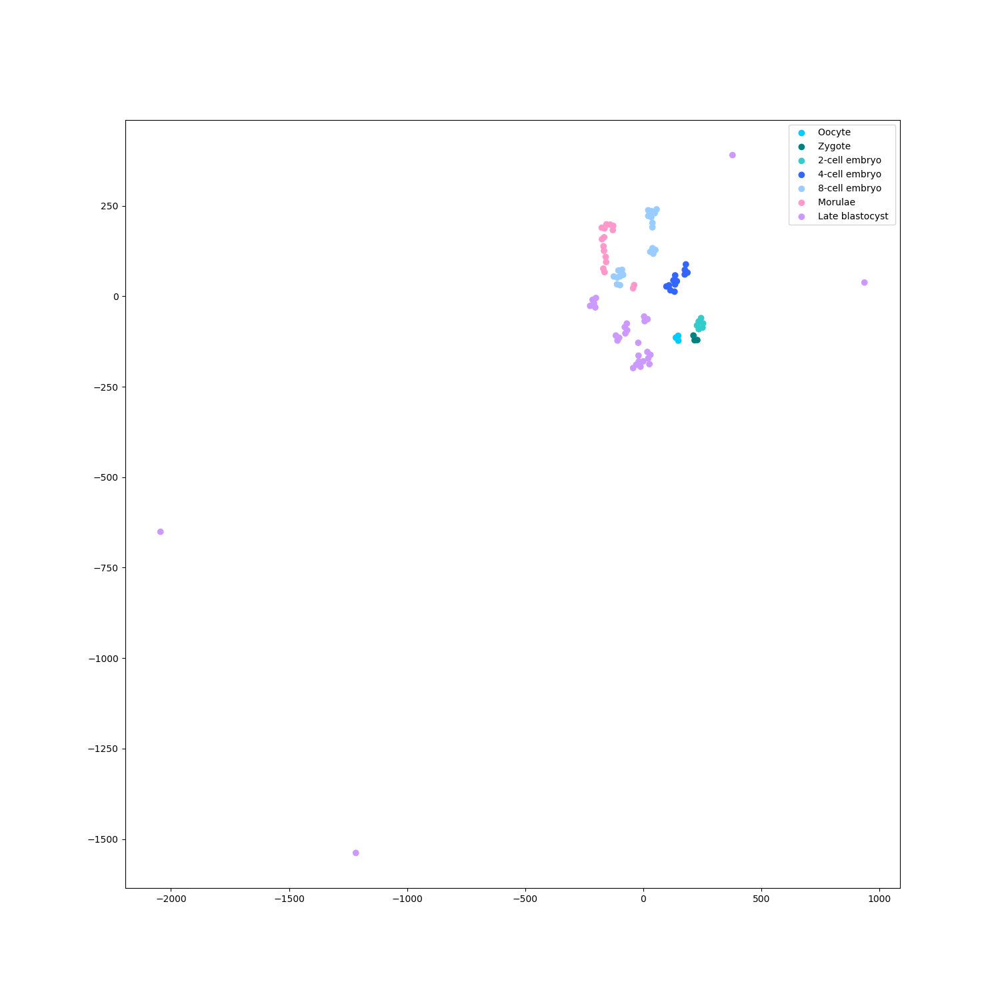

# StackingSingleCellClassify

Comprehensive single-cell clustering implementations by python

全面的单细胞聚类 python 实现

## Files and functions 文件与功能

### `ReadData.py`

Read data from `.mat`, `.csv` and `.txt` files.

从 `.mat`, `.csv`, `.txt` 文件中读取数据

### `Utils.py`

Some tools including:

* Get colors for painting base on labels.
* Scatter with displaying labels.
* Accuracy compute.

包括一些常用工具：

* 根据标签获得颜色值，用于作图
* 制作带有标签图例的散点图
* 准确率计算

### `DimensionReduction.py`

Methods of dimension reduction including:

* t-SNE
* PCA

包括一些降维方法：

* t 分布随机近邻嵌入
* 主成分分析

### `Clustering.py`

Clustering methods including:

* k-means
* k-NN
* hca

包括一些聚类方法：

* k 均值聚类
* k 最近邻法
* 层次聚类

### `Examples_***.py`

Examples for processing.

流程的一些例子.

## Xin dataset (human islet) 1600 samples using t-SNE

Xin 数据集（人胰岛细胞）1600 样本 使用 t-SNE 降维并可视化

perplexity = 50

perplexity = 5

This dataset file is too large to upload, please download it from:

此数据集文件过大，无法上传，请从以下链接下载：

[data-download](https://www.ncbi.nlm.nih.gov/geo/download/?acc=GSE81608&format=file&file=GSE81608%5Fhuman%5Fislets%5Frpkm%2Etxt%2Egz)

[label-download](https://s3.amazonaws.com/scrnaseq-public-datasets/manual-data/xin/human_islet_cell_identity.txt)

Xin, Y. et al. RNA Sequencing of Single Human Islet Cells Reveals Type 2 Diabetes Genes. Cell Metab. 24, 608–615 (2016)

## Yang dataset (human embryo devel) 90 samples using t-SNE

Yang 数据集（人胚胎发育）90 样本 使用 t-SNE 降维并可视化

perplexity = 40

perplexity = 5

Yan, L. et al. Single-cell RNA-Seq profiling of human preimplantation embryos and embryonic stem cells. Nat. Struct. Mol. Biol. 20, 1131–1139 (2013)

## Corr datasets

### Human islet dataset / 60 samples / perplexity = 5

人胰岛数据集 / 60 样本 / 困惑度 = 5

k-NN prediction:

使用 k-NN 进行训练和自预测:

准确率 0.9667 (58/60) 'delta' 类的两个样本都分类错误

Accuracy = 0.9667 (58/60) The class 'delta' (2 samples) are totally missed.

hierarchy dendogram:

使用层次聚类进行分类：

scatter for hierarchy cluster result:

层次聚类结果散点图：

### Human cancer dataset / 33 samples / perplexity = 5

人癌细胞数据集 / 33 样本 / 困惑度 = 5

Jiang, H., Sohn, L., Huang, H., & Chen, L. (2018). Single Cell Clustering Based on Cell-Pair Differentiability Correlation and Variance Analysis. (May).
