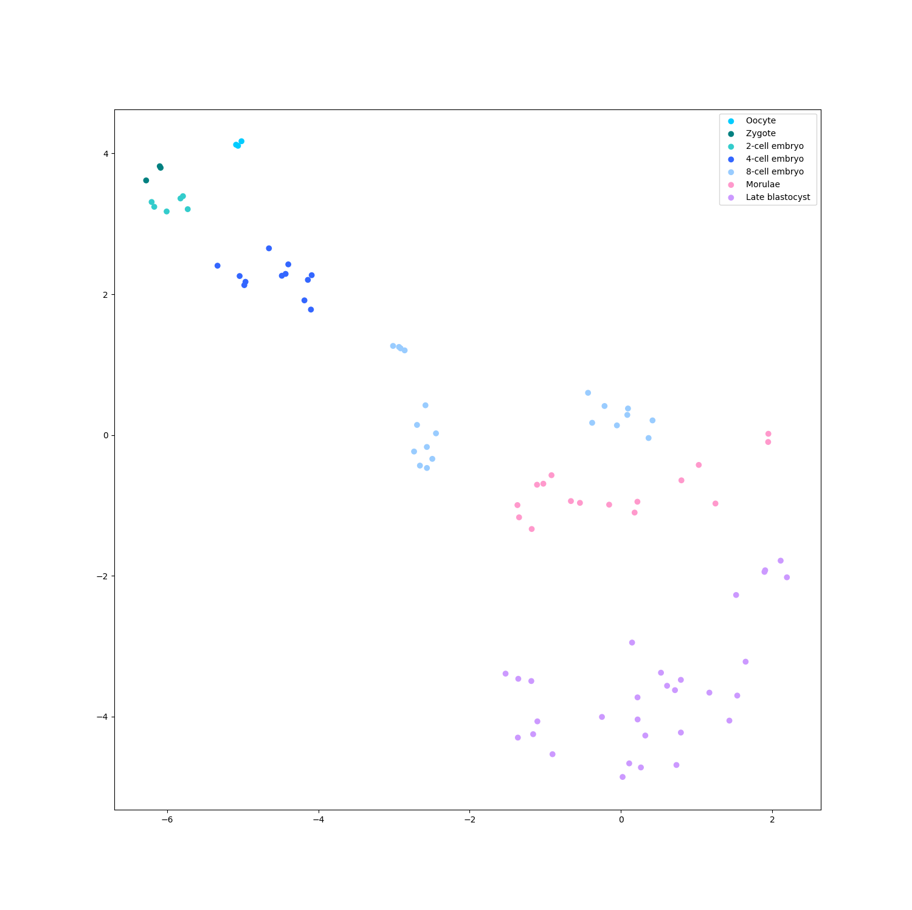
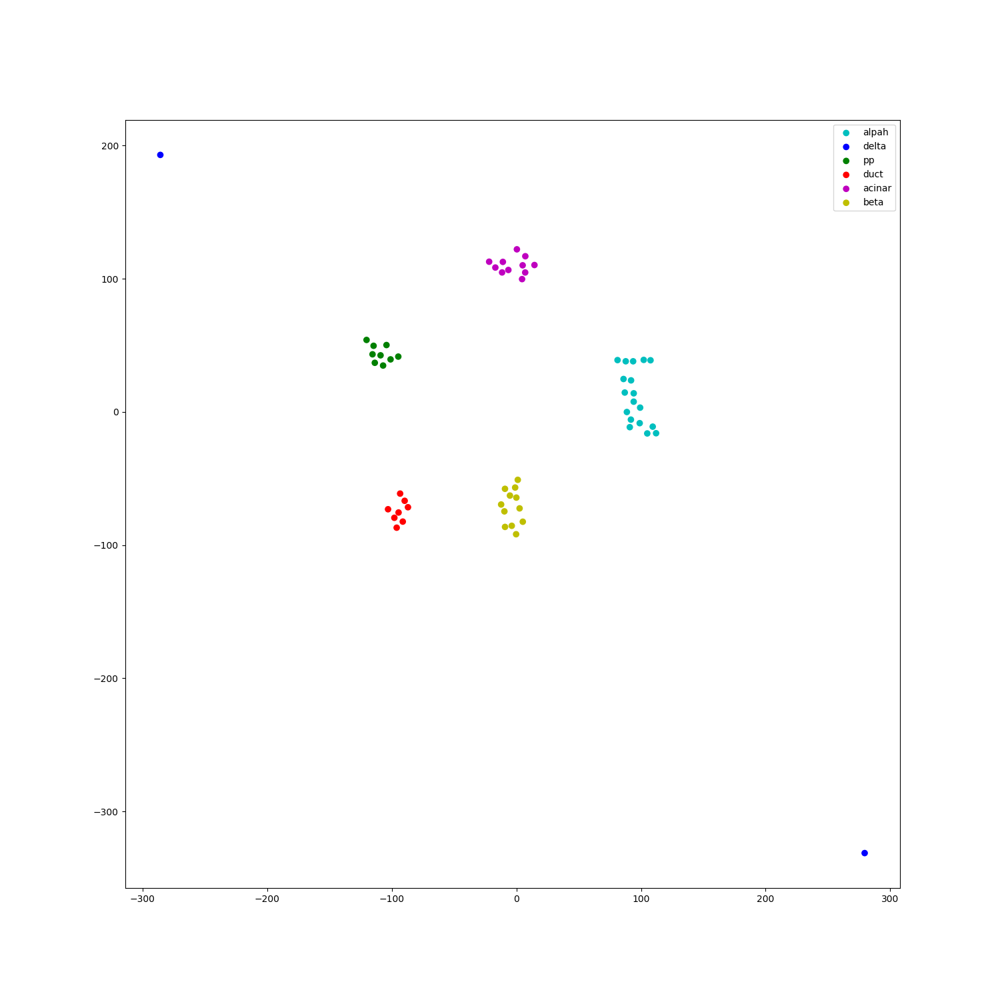
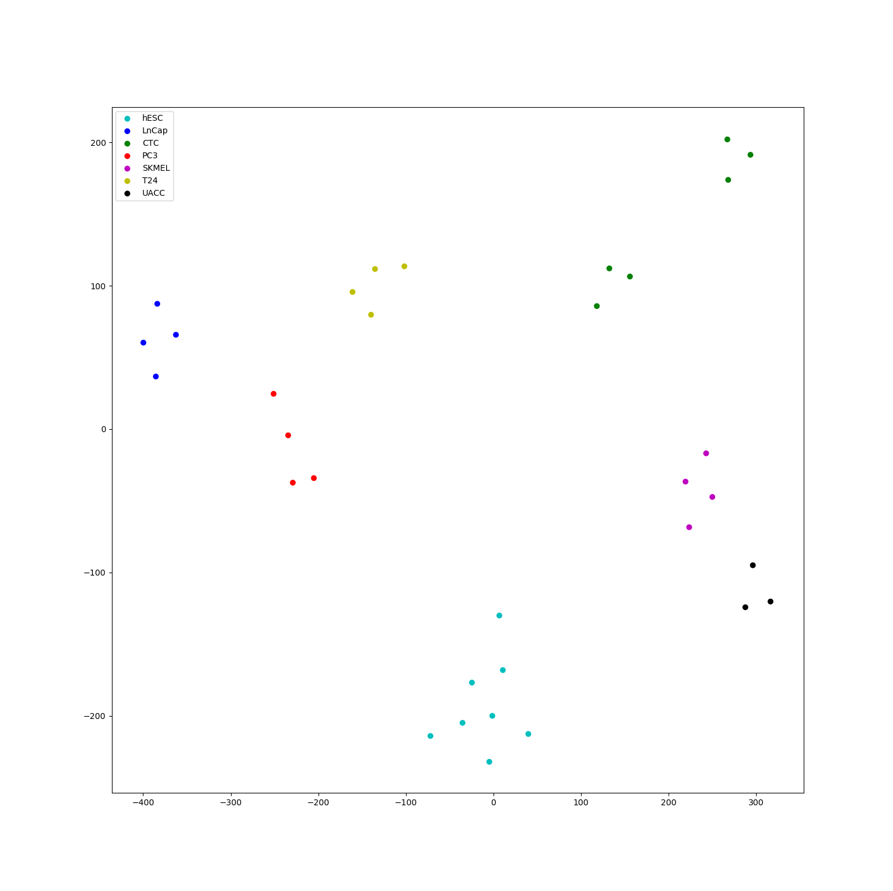

# StackingSingleCellClassify

My ideas and implements.

## Xin dataset (human islet) 1600 samples using t-SNE

perplexity = 50

perplexity = 5

This dataset file is too large to upload, please download it from:

[data-download](https://www.ncbi.nlm.nih.gov/geo/download/?acc=GSE81608&format=file&file=GSE81608%5Fhuman%5Fislets%5Frpkm%2Etxt%2Egz)

[label-download](https://s3.amazonaws.com/scrnaseq-public-datasets/manual-data/xin/human_islet_cell_identity.txt)

Xin, Y. et al. RNA Sequencing of Single Human Islet Cells Reveals Type 2 Diabetes Genes. Cell Metab. 24, 608–615 (2016)

## Yang dataset (human embryo devel) 90 samples using t-SNE

perplexity = 40

perplexity = 5

Yan, L. et al. Single-cell RNA-Seq profiling of human preimplantation embryos and embryonic stem cells. Nat. Struct. Mol. Biol. 20, 1131–1139 (2013)

## Corr datasets

Human islet dataset / 60 samples / perplexity = 5

Human cancer dataset / 33 samples / perplexity = 5

Jiang, H., Sohn, L., Huang, H., & Chen, L. (2018). Single Cell Clustering Based on Cell-Pair Differentiability Correlation and Variance Analysis. (May).